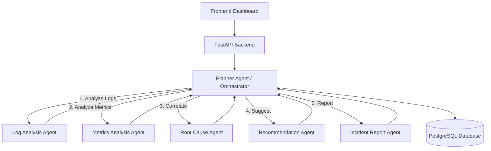

# AI Operations Copilot — Agentic Incident Analysis Platform

## 1. System Overview & Problem Statement

**Problem:**
During software incidents, on-call engineers face a flood of fragmented data—logs, metrics, and alerts. Synthesizing this information to find the root cause is stressful, error-prone, and time-consuming. Existing tools either provide raw data (Dashboards) or black-box "magic" without context.

**Solution:**
The **AI Operations Copilot** is a planner-based agentic system that acts as a "virtual incident commander." It systematically analyzes incident data, correlates findings, and produces a structured, explainable incident report with safe, read-only recommendations. It never acts autonomously, ensuring safety and human-in-the-loop control.

---

## 2. High-Level Architecture

The system follows a **Planner-Agent Pattern** to ensure determinism and reliability.



- **Frontend**: Next.js dashboard for inputting data and viewing live agent progress.
- **Backend**: FastAPI for orchestration and API surface.
- **Planner Agent**: The "brain" that delegates tasks, validates outputs, and maintains state.
- **Specialized Agents**: Stateless workers focused on single domains (Logs, Metrics, etc.).

---

## 3. Agent Responsibilities

### 1. Planner Agent (The Orchestrator)
- **Role**: Workflow manager.
- **Responsibility**: validated input, enforces execution order (Logs/Metrics -> Root Cause -> Report), handles failures, and aggregates results.
- **Constraint**: Domain-agnostic. Does not "think" about the incident, only about the *process*.

### 2. Log Analysis Agent
- **Role**: Pattern Detector.
- **Input**: Raw log lines (text).
- **Processing**: Regex pattern matching, clustering similar error messages settings.
- **Output**: Structured list of `LogPattern` (e.g., "500 Internal Server Error - 150 occurrences").

### 3. Metrics Analysis Agent
- **Role**: Anomaly Detector.
- **Input**: Time-series data points (CPU, Memory, Latency, Error Rate).
- **Processing**: Statistical thresholding (e.g., Z-score > 3).
- **Output**: List of `Anomaly` (e.g., "Latency spike > 2000ms at T-5min").

### 4. Root Cause Agent
- **Role**: Correlator.
- **Input**: Outputs from Log and Metrics agents.
- **Processing**: Heuristic correlation (e.g., "Latency spike coincided with DB Connection Timeout logs").
- **Output**: `ProbableCause` with a **Confidence Score** (0.0 - 1.0).

### 5. Recommendation Agent
- **Role**: Advisor.
- **Input**: Probable Cause.
- **Processing**: Lookup from a knowledge base or best-practices heuristic.
- **Output**: List of `ActionStep`. **Strictly Read-Only** (e.g., "Check database connection pool limits").

### 6. Incident Report Generator
- **Role**: Scribe.
- **Input**: All previous agent outputs.
- **Processing**: Formatting and summarization.
- **Output**: Markdown formatted Postmortem Report.

---

## 4. End-To-End Workflow

1.  **Incident Trigger**: User inputs incident details (or webhook triggers it) -> `POST /incidents`.
2.  **Orchestration Start**: Planner validates payload.
3.  **Parallel Analysis**:
    *   Planner calls `Log Analysis Agent`.
    *   Planner calls `Metrics Analysis Agent`.
4.  **Synthesis**:
    *   Planner passes aggregated findings to `Root Cause Agent`.
5.  **Advisory**:
    *   Planner passes Root Cause to `Recommendation Agent`.
6.  **Reporting**:
    *   Planner calls `Incident Report Generator`.
7.  **Completion**: Final JSON output stored in DB; Frontend updates via polling/stream.

---

## 5. Backend API Design

**POST /api/v1/incidents/analyze**
- **Input**:
  ```json
  {
    "description": "API high latency",
    "logs": ["..."],
    "metrics": {"cpu": [...], "latency": [...]}
  }
  ```
- **Output**: `job_id` (Async processing)

**GET /api/v1/incidents/{job_id}/status**
- **Output**:
  ```json
  {
    "status": "processing",
    "step": "root_cause_analysis",
    "artifacts": { ... }
  }
  ```

**GET /api/v1/incidents/{job_id}/report**
- **Output**: Final Postmortem Markdown.

---

## 6. Database Schema (PostgreSQL)

```sql
CREATE TABLE incidents (
    id UUID PRIMARY KEY,
    description TEXT,
    created_at TIMESTAMP DEFAULT NOW(),
    status TEXT -- 'pending', 'analyzing', 'completed', 'failed'
);

CREATE TABLE analysis_results (
    id UUID PRIMARY KEY,
    incident_id UUID REFERENCES incidents(id),
    agent_name TEXT, -- 'log_agent', 'metrics_agent'
    output JSONB,
    created_at TIMESTAMP DEFAULT NOW()
);

CREATE TABLE reports (
    id UUID PRIMARY KEY,
    incident_id UUID REFERENCES incidents(id),
    title TEXT,
    content_markdown TEXT,
    generated_at TIMESTAMP
);
```

---

## 7. Frontend Page Structure

1.  **Dashboard (`/`)**: List of recent incidents with status badges (Analyzing, Completed).
2.  **New Incident (`/new`)**: Form to paste logs/metrics or upload snippets.
3.  **Incident Detail (`/incidents/[id]`)**:
    *   **Header**: Status and ID.
    *   **Progress Stepper**: Visual indicator of the Planner's current step.
    *   **Agent Outputs**: Collapsible sections for "Logs", "Metrics", etc.
    *   **Result Card**: Highlighted Root Cause and Recommendations.
    *   **Report Tab**: Rendered Markdown postmortem.

---

## 8. Safety & Scope Controls

1.  **Read-Only Architecture**: No agent has write access to infrastructure. Codebase contains NO `subprocess`, `os.system` or API clients that accept Write verbs (POST/PUT/DELETE) to external infra.
2.  **Confidence Thresholds**: Root Cause Agent must output `confidence_score`. UI displays "Low Confidence" warning if score < 0.7.
3.  **Human-in-the-loop**: Recommendations are presented as text to be read by a human, never executed.
4.  **Input Sanitation**: Strict Pydantic validation to reject malformed or malicious payloads.
5.  **Deterministic execution**: The Planner defines a strict graph. Agents cannot invoke other agents directly.

---

## 9. Testing Strategy

1.  **Unit Tests (`pytest`)**:
    *   Test each agent in isolation with mock data.
    *   Ensure Log Agent correctly groups regex patterns.
    *   Ensure Metrics Agent flags known spikes.
2.  **Integration Tests**:
    *   Mock the entire flow from Planner -> Agents.
    *   Verify data handover matches Pydantic schemas.
3.  **Safety Regression**:
    *   Verify the system gracefully handles "No logs" or "Ambiguous data" without crashing or hallucinating a cause (should return "Unknown").

---

## 10. 7-Day Realistic Build Plan

- **Day 1**: **Design & Scaffold**. Initialize repo, sets up FastAPI + Next.js, writes Schema.
- **Day 2**: **Core Agents (Basic)**. Implement Log and Metrics agents with simple heuristic logic (Regex/Math).
- **Day 3**: **Planner Logic**. Implement the Orchestrator, State management, and Database connectivity.
- **Day 4**: **Advanced Agents**. Implement Root Cause and Recommendation logic (simple rule-based first).
- **Day 5**: **Frontend Integration**. Connect Next.js to FastAPI. Display Agent steps live.
- **Day 6**: **Reporting & Polish**. Generate Markdown reports. proper CSS styling (Tailwind).
- **Day 7**: **Testing & Documentation**. Write pytests, verify safety constraints, finalize README.

---

## 11. Resume-Ready Project Description

**AI Operations Copilot**
*Designed and built an agentic AI platform to assist SREs in root cause analysis, reducing incident triage time.*
- **Architecture**: Orchestrated a **multi-agent system** using a central Planner pattern to coordinate specialized workers (Log Analysis, Metrics Anomaly Detection) in a deterministic workflow.
- **Safety**: Enforced strict **read-only boundaries** and **confidence scoring**, ensuring safe human-in-the-loop operations for critical infrastructure.
- **Tech Stack**: Developed a **FastAPI** backend with **Pydantic** for rigid schema validation, and a **Next.js** dashboard for real-time visualization of agent reasoning.
- **Impact**: Simulated a reduction in MTTR (Mean Time To Resolution) by automatically synthesizing fragmented observability data into structured Postmortem reports.
